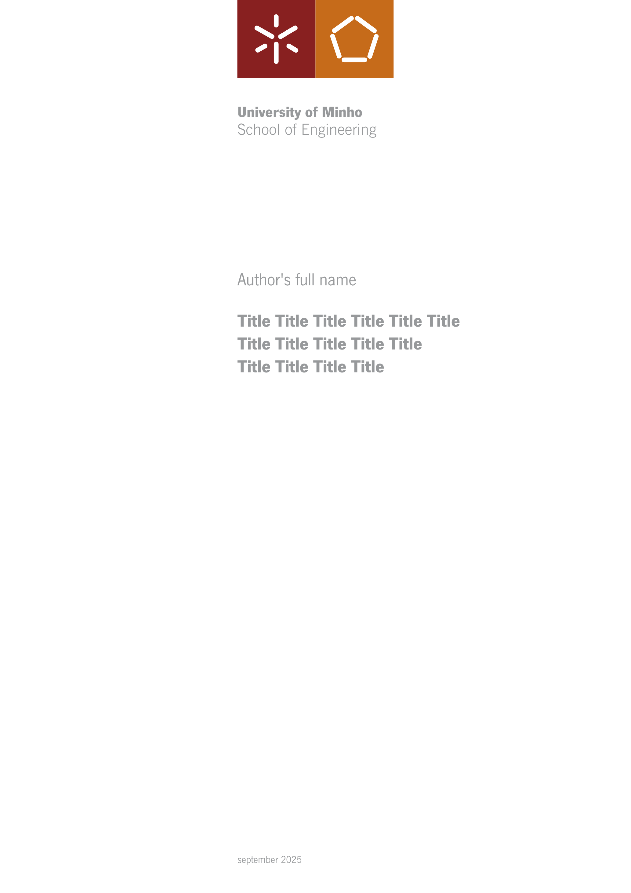

# uminho-thesis

The official Typst template for writing theses at the University of Minho. 



It is based on the [official LaTeX template provided by the Department of Informatics](https://web.di.uminho.pt/sitedi/latex/) and fully complies with the [university’s required formatting standards and guidelines](https://alunos.uminho.pt/PT/estudantes/Paginas/InfoUteisFormatacao.aspx). 

This template closely follows the LaTeX version, while providing improvements in features, usability and presentation. It is designed to be as extensible, customizable, and comprehensible as possible right out of the box.

You can find the unmodified output of the template in [example.pdf](./example.pdf).

## How to use this template

To use this template in the Typst Web App, create a new project by selecting "Start from template" and searching for this project. The correct fonts should be applied automatically.
 
### Using Locally

To work locally, first [install Typst](https://typst.app/open-source/), then initialize your project with:
```
typst init @preview/uminho-thesis
```

When compiling your project, ensure that the necessary fonts are either installed system-wide (use `typst fonts` to check), or specify your font directory by adding `./fonts` as a valid font folder in your Typst LSP settings. Alternatively, if running Typst from the command line, use the `--font-path ./fonts` option.

## Current Limitations

Currently, this template only supports covers for Master's theses and does not yet accommodate Doctoral (PhD) theses. Contributions to expand this support are welcome. 

By default, the template includes only the required School of Engineering logos for the cover, but you can easily change these to your own school's logo. The official and high-resolution logos are available in the [official formatting guidelines](https://alunos.uminho.pt/PT/estudantes/Paginas/InfoUteisFormatacao.aspx).

## License

This template is provided under the [MIT License](./LICENSE).

All fonts and official logos belong to University of Minho.